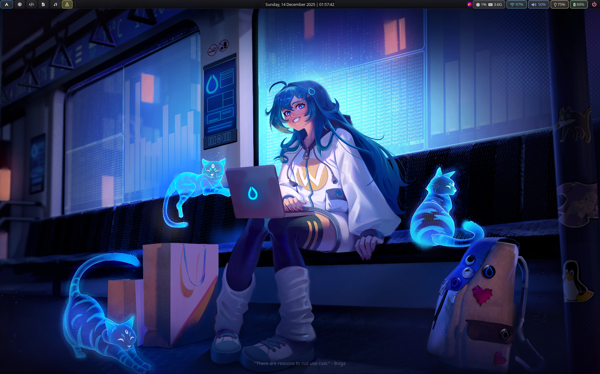

# zephyr00t-hyprland

This repository documents is  my ongoing experiment in building a **focused development environment** on Arch Linux with Hyprland.

After years of working on Windows and Hackintosh systems, I wanted something lighter and more intentional — an environment without bloat, without gimmicks, and without hidden automation.

This setup is built to stay out of the way.  
The goal is not visual spectacle, but **clarity, stability, and control**.

Only the parts that can be shared safely are included here: the UI layer (Waybar), the interaction layer (Wofi), and a small set of scripts that connect everything together.  
Core Hyprland configuration is intentionally kept local and machine-specific.

---

## Repository Structure

```text
├── LICENSE
├── README.md
├── screenshots
│   ├── desktop.png
│   ├── waybar1.png
│   ├── waybar2.png
│   ├── waybar3.png
│   └── wifi-menu.png
├── scripts
│   ├── powermenu
│   ├── waybar-resources
│   └── wifi-menu
├── waybar
│   ├── config
│   └── style.css
└── wofi
    ├── config
    └── style.css
```


---

## Requirements

- Arch Linux
- Hyprland
- Waybar
- Wofi
- NetworkManager (`nmcli`)
- Wayland-compatible terminal (kitty, foot, etc.)
- Nerd Font (JetBrainsMono Nerd Font recommended)

---

## Screenshots




---

## Notes

This repository is not intended as a drop-in configuration or starter kit.  
It reflects a personal workflow and evolves slowly through daily use.

Feel free to explore, adapt, or borrow ideas — but treat the window manager layer with care.

---

## License

Creative Commons Zero v1.0 Universal
